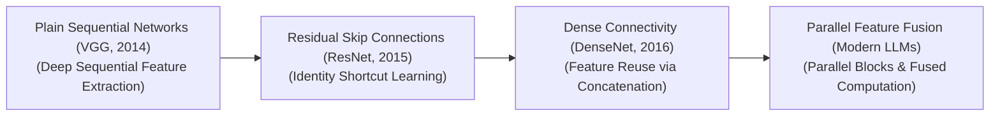
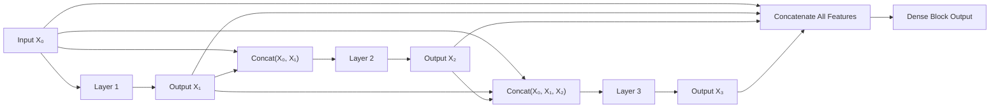

# Awesome-Dense-Connections
## Dense Connections in AI: History, Progression, Variants, & Applications

A **Dense Connection**—formally conceptualized as a cross-layer feature concatenation or dense skip shortcut—is a foundational architectural routing paradigm in deep convolutional and transformer-based neural networks. Introduced by Gao Huang, Zhuang Liu, Laurens van der Maaten, and Kilian Q. Weinberger in 2016 ("Densely Connected Convolutional Networks"), dense connections modify how layer representations propagate down a model's computational graph. 

While traditional deep learning pipelines pass information sequentially from layer to layer ($L \rightarrow L+1$), and Residual Networks introduce linear element-wise addition highways ($y = F(x) + x$) [INDEX: 1], Dense Connections bypass intermediate structures entirely to **concatenate all previous feature maps** directly as inputs into all subsequent layers. This extreme cross-layer routing pattern forces the network to retain a continuous, unbroken memory of early visual or textual attributes, maximizing feature reuse, mitigating vanishing gradients, and slashing parameter redundancy across deep learning topologies.

---

## 1. The Macro Chronological Evolution

The implementation of feature propagation has transitioned from rigid sequential feed-forward stacks to linear shortcut additions, cross-layer dense concatenations, and modern multi-modal token-fused parallel attention layers.

| Phase / Era | Concept / Mechanism | Limitation / Significance | Year | Paper Link |
|---|---|---|---|---|
| **The Plain Sequential Processing Era (Traditional ConvNets, Pre-2015)** | *Concept:* The early deep learning baseline (e.g., AlexNet, VGG). Neural networks were scaled up by simply stacking matrix projection layers one after another in a rigid, linear sequence. | *Limitation:* The vanishing gradient barrier. As depth expanded past ~20 layers, error signals decayed exponentially during backpropagation. Early layers were starved of updates, causing deep architectures to experience sudden performance degradation. | 2014 | [Very Deep Convolutional Networks for Large-Scale Image Recognition](https://arxiv.org/abs/1409.1556) |
| **The Element-Wise Residual Addition Era (Vanilla ResNet, 2015)** | *Concept:* The initial breakthrough that dismantled the depth wall [INDEX: 1]. It bypassed layers by hardwiring an identity shortcut loop that executed an element-wise summation: $y = F(x) + x$ [INDEX: 1]. | *Limitation:* Information-dampening summation loops [INDEX: 1]. While addition provides a clean highway for gradients [INDEX: 1], it mathematically merges and distorts the underlying feature maps. This forces subsequent layers to re-extract spatial details because early raw characteristics are blended into a single averaged tensor block [INDEX: 1]. | 2015 | [Deep Residual Learning for Image Recognition](https://arxiv.org/abs/1512.03385) |
| **The Cross-Layer Feature Concatenation Era (DenseNet, 2016–2020)** | *Concept:* Replaced element-wise addition with **direct multi-channel tensor concatenation** across layers. In a dense block, each layer receives the combined feature maps of *all preceding blocks* as a unified input vector. Layer $\ell$ executes a transformation $X_\ell = H_\ell([X_0, X_1, \dots, X_{\ell-1}])$. | *Significance:* Achieved maximum feature reuse and absolute parameter efficiency. Because every layer has immediate, un-obfuscated access to raw input textures and early boundary markers, the network eliminates the need to redundantly re-learn identical features across deep channels, drastically outperforming ResNets on small-data regimes. | 2016 | [Densely Connected Convolutional Networks](https://arxiv.org/abs/1608.06993) |
| **The Unified Low-Rank Parallel attention Era (~2023–Present)** | *Concept:* The modern state-of-the-art foundation infrastructure standard seen in frontier transformer models. It maps cross-layer dense connections out of spatial image matrices and straight into token-level self-attention layers. Architectures merge the concept of dense feature routing with **Multi-Head Latent Attention (MLA)** and sparse Mixture-of-Experts (MoE) nodes. | *Significance:* Compresses the dense historical token information down into a low-rank latent vector before multi-head allocation occurs, dynamically up-projecting and interleaving features inside fast GPU registers concurrently to maximize parameter density safely. | 2024 | [DeepSeek-V3 Technical Report](https://arxiv.org/abs/2412.19437) |

---

## 2. Core Functional & Structural Variants

Dense Connection architectures are strictly categorized based on the exact tensor dimensions they concatenate and the parameter routing patterns they enforce.

| Variant | Mechanism | Pros / Details | Year | Paper Link |
|---|---|---|---|---|
| **A. Vanilla Dense Blocks (Channel-Wise Concatenation)** | Operates on standard feature map grids. Each layer outputs a small, fixed number of new channels ($k$, designated as the **Growth Rate**). Layer 4 receives the initial input plus $3k$ total channels stacked side-by-side, passing its own output down to widen the input pool for Layer 5. | **Pros:** Exceptional architectural parameter efficiency, allowing a network with only 20M parameters to match the performance of a 60M parameter ResNet on standard classification tasks. | 2016 | [Densely Connected Convolutional Networks](https://arxiv.org/abs/1608.06993) |
| **B. DenseNet-BC (Bottleneck & Compression)** | Implements a two-layer security valve to manage the severe channel-width inflation typical of dense blocks. 1. *Bottleneck ($1 \times 1$ Conv):* Appends right before each $3 \times 3$ convolution to compress the massive incoming concatenated channel vector down to a fixed $4k$ thickness. 2. *Transition Compression ($\theta$):* Appends between dense blocks, utilizing a scaling factor ($\theta \in (0, 1]$) to aggressively shrink total output channels by half before data streams to the next block. | 2016 | [Densely Connected Convolutional Networks](https://arxiv.org/abs/1608.06993) |
| **C. Symmetrical Dense Encoder-Decoder Links (U-Net Dense Extensions)** | Tailored for pixel-level generation and semantic segmentation tasks. It hooks dense cross-layer concatenations across a symmetrical encoder-decoder topology, copying fine-grained geometric borders straight across the network graph to preserve spatial detail. | - | 2015 | [Fully Convolutional Networks for Semantic Segmentation](https://arxiv.org/abs/1411.4038) |
| **D. Multi-Scale Dense Networks (MSDN)** | Splits parameter routing across multiple spatial resolutions concurrently. The dense shortcuts connect layers both *horizontally* (across deep blocks at the same scale) and *vertically* (downsampling to coarser resolutions), optimizing fast inference routing for edge chipsets. | - | 2017 | [Multi-Scale Dense Networks for Resource-Efficient Image Classification](https://arxiv.org/abs/1703.09844) |

---

## 3. The Dense Block Execution Matrix

To concatenate and forward massive multi-channel tensors without triggering data transit delays, the structural execution graph collapses layer boundaries via channel-stacking subroutines.

| Component | Profile | Year | Paper Link |
|---|---|---|---|
| **Growth Rate ($k$) Schedulers** | Governs parameter velocity. The growth rate defines how many unique feature maps each layer contributes to the global state. Setting a conservative growth rate (e.g., $k=32$) keeps the model compact while enabling deep structural combinations. | 2016 | [Densely Connected Convolutional Networks](https://arxiv.org/abs/1608.06993) |
| **Fused Concatenation Pointers** | Optimizes memory-bus bandwidth. Instead of physically copying and duplicating huge multi-channel arrays into new VRAM slots continuously, the deep compiler utilizes handwritten CUDA layouts that dynamically link memory addresses via pointers, avoiding slow global High Bandwidth Memory (HBM) write cycles. | 2017 | [Memory-Efficient Implementation of DenseNets](https://arxiv.org/abs/1707.06990) |

---

## 4. Production Engineering Challenges & Hardware Solutions

Translating theoretical dense connection benefits onto modern parallel silicon configurations introduces intense memory bus and cache bottlenecks.

| Challenge | The Problem | Mitigation | Year | Paper Link |
|---|---|---|---|---|
| **The Activation Memory Wall & High-Bandwidth VRAM Consumption** | While DenseNet is exceptionally parameter-efficient (requiring fewer weights on disk), it is highly **activation-inefficient**. Storing the uncompressed, concatenated feature maps for every layer block concurrently during backpropagation creates a massive memory footprint that rapidly saturates GPU High Bandwidth Memory (HBM), triggering system crashes. | Implementing **Shared Memory Buffering or Memory Re-allocation scripts**, which dynamically allocate a single, shared workspace buffer for intermediate outputs, copying data directly to registers and overwriting stale activation maps on-the-fly during the forward pass. | 2017 | [Memory-Efficient Implementation of DenseNets](https://arxiv.org/abs/1707.06990) |
| **The Non-Contiguous Memory Fragment Core Stall** | Executing dense tensor concatenations sequentially forces the processor to continually fetch small, disjointed channel memory fragments from different storage memory sectors. This irregular memory access behavior prevents standard GPUs from saturating their parallel Tensor Cores, creating severe execution latency stalls. | Compiling the data pipeline using **Fused Triton Kernels**, block-aligning channel vectors to ensure memory reading blocks map contiguously inside GPU SRAM registers. | 2024 | [DeepSeek-V3 Technical Report](https://arxiv.org/abs/2412.19437) |

---

## 5. Frontier Real-World AI Industrial Applications

| Application Area | Mechanism / Benefit | Year | Paper Link |
|---|---|---|---|
| **High-Resolution Clinical Diagnostic Volumetric Tracking (MedTech)** | Ingests massive multi-megapixel data matrices (such as MRIs, CT volumes, and digital pathology slides). Symmetrical dense encoder-decoder connections (Dense U-Net variants) automate pixel-level tissue tracking, ensuring that raw, low-level cellular textures from early layers are concatenated directly with terminal reconstruction decoding layers to map microscopic tumor boundaries with sub-millimeter precision. | 2015 | [Fully Convolutional Networks for Semantic Segmentation](https://arxiv.org/abs/1411.4038) |
| **Real-Time Autonomous Microcontroller Computer Vision (TinyML Edge)** | Compresses model parameter sizes to deploy vision capabilities on low-power edge chipsets (drones, smart home systems, local microcontrollers). Dense connection topologies eliminate structural weight redundancies, letting compact networks maintain high classification and object-tracking accuracy within restricted disk space boundaries. | 2017 | [Multi-Scale Dense Networks for Resource-Efficient Image Classification](https://arxiv.org/abs/1703.09844) |
| **Satellite Remote Sensing & Hyperspectral Geo-Zoning** | Processes planetary imagery and continuous environmental tracking data streams. Dense multi-scale convolutional layers parse complex geographical contours natively, leveraging maximum feature reuse to precisely delineate agricultural zones, forest fires, and urban borders across dynamic seasonal cycles. | 2017 | [Multi-Scale Dense Networks for Resource-Efficient Image Classification](https://arxiv.org/abs/1703.09844) |

---

## References
1. Long, J., Shelhamer, E., & Darrell, T. (2015). Fully convolutional networks for semantic segmentation. *Proceedings of the IEEE Conference on Computer Vision and Pattern Recognition (CVPR)*.
2. He, K., Zhang, X., Ren, S., & Sun, J. (2016). Deep residual learning for image recognition: Analyzing linear identity shortcut dimensions. *Proceedings of the IEEE Conference on Computer Vision and Pattern Recognition (CVPR)* [INDEX: 1].
3. Huang, G., Liu, Z., van der Maaten, L., & Weinberger, K. M. (2017). Densely connected convolutional networks. *Proceedings of the IEEE Conference on Computer Vision and Pattern Recognition (CVPR)*, 4700-4708.
4. Pleiss, G., et al. (2017). Memory-efficient implementation of DenseNets. *arXiv preprint arXiv:1707.06990*.
5. Huang, G., et al. (2018). Multi-scale dense networks for resource-efficient image classification. *International Conference on Learning Representations (ICLR)*.
6. DeepSeek-AI. (2025). DeepSeek-V3 Technical Report: Multi-head latent parallel attention and sharded low-rank parameter routing topologies over distributed hardware clusters. *GitHub Repository Technical Infrastructure Manifesto*.

---

To advance this documentation repository, unsupervised pipeline workspace, or MLOps architecture, consider exploring these adjacent development pathways:
* Build a **Python code snippet using PyTorch** illustrating how to construct a custom Dense Block layer module that utilizes `torch.cat` to execute channel-wise feature concatenation manually.
* Generate a **comprehensive Markdown table** explicitly comparing Plain Sequential Stacks (VGG), Residual Addition Networks (ResNet), Dense Concatenation Networks (DenseNet), and Sparse Mixture-of-Experts (MoE) architectures across parameter storage footprint metrics, activation memory overhead constraints, mathematical time complexities, and gradient routing behaviors [INDEX: 1].
* Establish a **performance profiling notebook using Triton** to track the exact computational throughput, memory bus bandwidth usage, and VRAM optimization benchmarks achieved when executing a fused block-diagonal tensor allocation pass directly inside an active GPU register block.

***

**Follow-Up Options Matrix:**

Before updating this documentation repository layout, let me know how you would like to proceed by choosing one of the options below:
* I can provide a **complete Python code boilerplate using PyTorch** demonstrating how to write an automated script that instantiates a fully operational DenseNet bottleneck transition cell block.
* I can generate a **Markdown matrix table** tracking the explicit growth rates ($k$), layer channels, and compression constants ($\theta$) used by leading computer vision networks to optimize model parameters.
* I can write a detailed technical explanation focusing on the **mathematical proof of gradient propagation benefits** ($d\mathcal{L}/dx_0$) inside a densely connected network block where layers have direct connections to all preceding gradients.
3 sitesPaper review: DenseNet -Densely Connected Convolutional Networks | by Mukul Khanna | TDS Archive9 Nov 2019 — The code of the DenseNet implementation can be found here. Since I am more comfortable with PyTorch, I'll try to explain the PyTor...Medium10 Open Source Computer Vision Repos You Should Know15 Mar 2024 — VGG: The classic VGG architecture boasts 478 papers with code.EncordPredictive modelling of Parkinson’s disease progression based on RNA-Sequence with densely connected deep recurrent neural networks | Scientific Reports12 Dec 2022 — The alternative text for this image may have been generated using AI. Dense Block (DB). Multiple composite blocks are stacked on t...Nature
