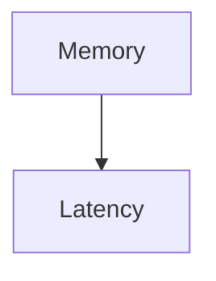

# The Non-Contiguous Memory Fragment Core Stall

## Detailed Information
This page provides more in-depth information about **Core Stall**.

## Architecture Diagram

[Back to Main README](../README.md)
