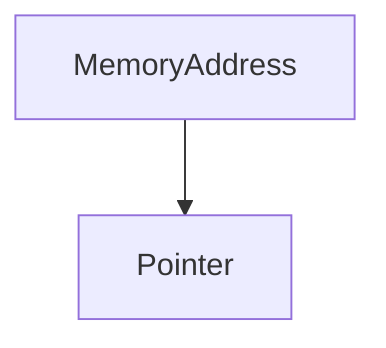

# Fused Concatenation Pointers

## Detailed Information
This page provides more in-depth information about **Fused Concatenation Pointers**.

## Architecture Diagram

[Back to Main README](../README.md)
