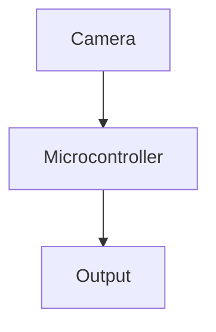

# Real-Time Autonomous Microcontroller Computer Vision (TinyML Edge)

## Detailed Information
This page provides more in-depth information about **TinyML Edge**.

## Architecture Diagram

[Back to Main README](../README.md)
